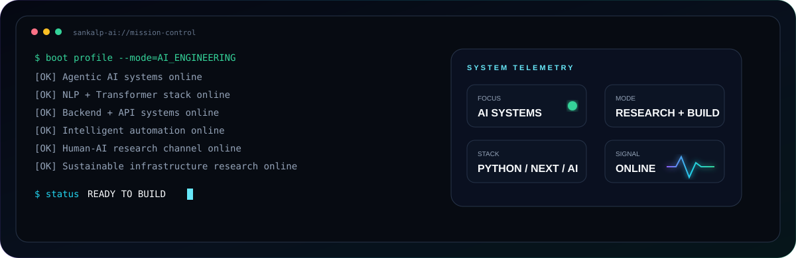
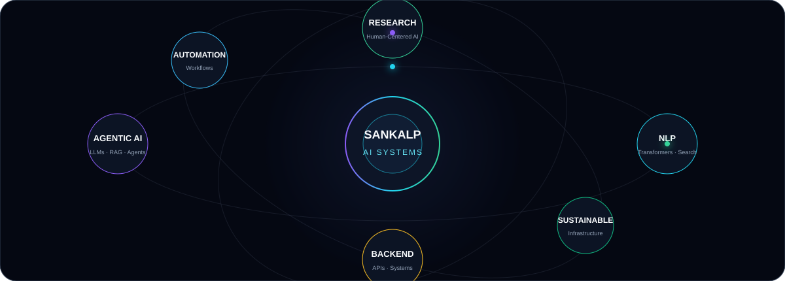
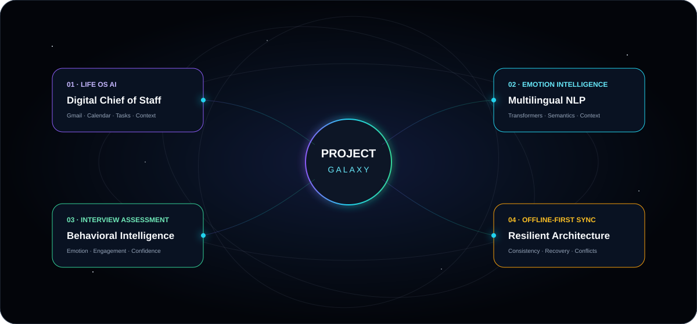
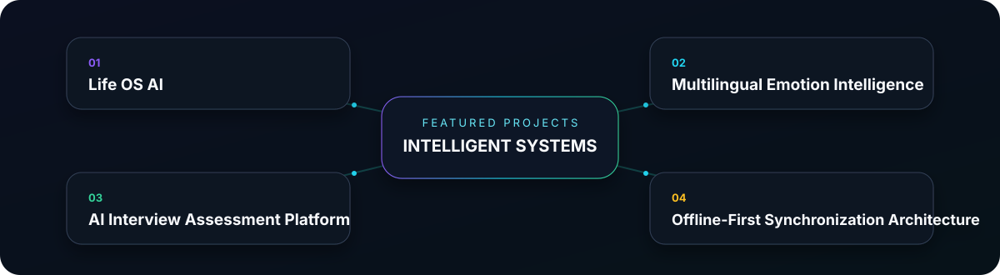
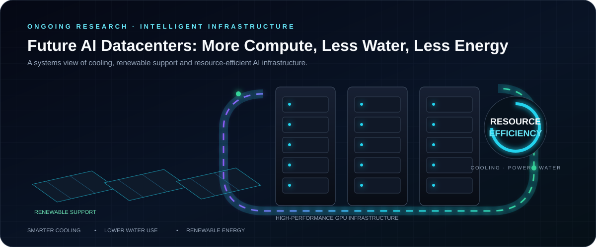
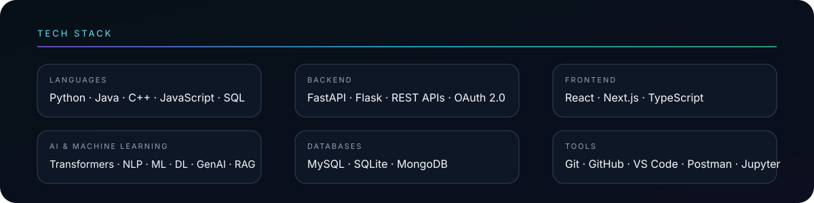

 

 

  

---

### 🧭 Quick Navigation

[📊 GitHub Stats](#-github-stats) · [👨‍💻 About](#-about-me) · [🚀 Projects](#-featured-projects) · [📄 Research](#-research-publication) · [🔬 Ongoing Research](#-ongoing-research-making-future-ai-datacenters-more-efficient) · [🧠 Interests](#-areas-of-interest) · [🛠 Tech Stack](#-tech-stack) · [🏆 Achievements](#-achievements) · [📫 Connect](#-connect)

---

# 📊 GitHub Stats

 

 

 

 

---

# 👨‍💻 About Me

### AI Engineer • Researcher • Problem Solver

I am passionate about building intelligent systems that solve real-world problems at scale.

My work spans across Artificial Intelligence, Natural Language Processing, Backend Engineering, and Intelligent Automation. I enjoy creating systems that can understand information, reason over context, automate decisions, and interact with real-world tools rather than simply generating responses.

Graduated with a B.Tech in Computer Science (Artificial Intelligence), I am particularly interested in the future of Agentic AI, Human-AI Interaction, Sustainable Computing, and Intelligent Infrastructure.

  

  

---

# 🚀 Featured Projects

  

<b>🧬 Open project architecture map</b>

 

  

### ⚡ Repository Radar

## Clinical Evidence Twin

> A human-in-the-loop clinical evidence workspace that helps hospital teams review fragmented records without hiding uncertainty behind an AI-generated answer.

[**View Repository →**](https://github.com/Sankalp-gupta1/clinical-evidence-twin)

The project addresses a practical problem in healthcare information workflows: records from different care teams can describe the same patient event differently, use different units, arrive at different times, or leave important follow-up information missing.

Instead of asking AI to decide what is clinically correct, **Clinical Evidence Twin keeps the original evidence visible and puts the human reviewer in control**.

### What I built

* **Source-linked patient timeline** — separates the date an event happened from the date a note was entered.
* **Conflict detection** — identifies contradictory statements only when they describe the same structured context.
* **Missing-information checks** — surfaces expected items that are absent from the supplied record set.
* **Safe unit normalization** — compares equivalent values such as 62 kg and 62000 g without creating a false conflict.
* **Human-in-the-loop LangGraph workflow** — validates evidence, builds the timeline, checks conflicts and missing items, then pauses for a reviewer before completion.
* **Evidence-first Q&A** — deterministic retrieval works without an LLM; optional AI summaries must cite known sources and fall back to original evidence if citation checks fail.
* **Hospital workspaces** — Better Auth accounts, owner/reviewer/viewer roles, owner-approved access requests, server-side authorization and audit history.
* **Multi-workspace isolation** — every protected request verifies hospital membership, while stale browser writes are rejected using revision checks and database locking.
* **Read-only MCP integration** — exposes source search, timelines and review items without allowing tools to alter records or make clinical decisions.

### Engineering Principle

> **When records disagree, the system should make the disagreement easier to inspect — not replace it with a confident-looking answer.**

**Tech Stack**

`Next.js` • `React` • `TypeScript` • `LangGraph` • `LangChain` • `PostgreSQL` • `Better Auth` • `Zod` • `MCP SDK` • `Gemini / Vercel AI Gateway` • `Vercel`

---
## Life OS AI

> An AI-powered personal operating system designed to act as a digital chief of staff.

Life OS AI integrates Gmail, Calendar, Tasks, and contextual memory to help users manage commitments, identify priorities, organize schedules, and make better decisions.

### Key Features

* Gmail & Calendar Integration
* AI-Powered Task Extraction
* Context-Aware Memory
* Personalized AI Assistant
* Priority Detection
* Productivity Intelligence Dashboard

**Tech Stack**

`FastAPI` • `Next.js` • `Gemini` • `OAuth 2.0` • `Gmail API` • `Google Calendar API` • `SQLite`

---

## Multilingual Emotion Intelligence

> A transformer-based NLP system focused on understanding emotions across multiple languages.

The project explores how AI can better understand human communication, emotional context, and sentiment across linguistic boundaries.

### Key Features

* Multilingual Emotion Detection
* Semantic Embeddings
* Transformer-Based NLP
* Contextual Understanding
* Cross-Language Analysis

**Tech Stack**

`Python` • `Transformers` • `Sentence Embeddings` • `NLP` • `Machine Learning`

---

## AI Interview Assessment Platform

> An intelligent interview analysis system designed to evaluate communication quality, confidence indicators, engagement levels, and emotional signals.

The platform aims to provide deeper insights into candidate performance beyond traditional assessments.

### Key Features

* Real-Time Interview Analysis
* Emotion Recognition
* Engagement Tracking
* Confidence Assessment
* Behavioral Intelligence

---

## Offline-First Synchronization Architecture

> A synchronization framework designed for applications that must continue functioning without internet connectivity.

The architecture focuses on reliability, conflict resolution, consistency management, and seamless recovery when connectivity returns.

### Areas Covered

* Offline Data Management
* Conflict Resolution
* Data Consistency
* Sync Recovery
* Distributed Application Design

---

# 📄 Research Publication

## Multilingual Emotion Detection using Transformer-Based NLP

Presented at:

**International Conference on Smart Systems and Intelligent Computing (ICSCIS), Romania**

This research investigates transformer-based approaches for multilingual emotion understanding and explores how AI systems can better interpret human communication across different languages.

### Links

📄 Research Paper: [https://drive.google.com/file/d/1p4vQD16q_ATUYpn9sLcYVkY9HbwCbQtt/view?usp=sharing]

---

# 🔬 Ongoing Research: Making Future AI Datacenters More Efficient

  

Whenever we use ChatGPT, Gemini, Tesla AI, or other advanced AI systems, thousands of powerful computers work together behind the scenes to process requests and train new models.

These computers contain high-performance GPUs that generate a huge amount of heat while running continuously. Just like a laptop heats up during gaming, AI servers become much hotter—but at a much larger scale.

To prevent overheating, datacenters use cooling systems that consume large amounts of water and electricity. As AI becomes more popular, the number of servers required continues to increase, making cooling and power consumption one of the biggest challenges for the future of AI infrastructure.

This raises an important question:

> **Can we build AI infrastructure that is powerful enough to support future AI models while using less water and less energy?**

I am currently exploring ideas around smarter cooling methods, renewable energy integration, and resource-efficient infrastructure that could help reduce the environmental impact of large-scale AI systems.

### What I'm Exploring

- Alternative cooling approaches for AI servers
- Reducing water consumption in datacenters
- Solar-powered support systems
- Energy-efficient AI infrastructure
- Sustainable computing for future AI workloads

### Long-Term Goal

To contribute toward building next-generation AI infrastructure that is both high-performance and environmentally responsible.

---

# 🧠 Areas of Interest

<table>
<tr>
<td width="50%" valign="top">

### Artificial Intelligence

* Agentic AI
* Large Language Models
* Retrieval-Augmented Generation (RAG)
* AI Agents
* Intelligent Automation
* Context-Aware Systems
* AI Workflow Orchestration

### Natural Language Processing

* Transformers
* Semantic Search
* Information Retrieval
* Emotion Intelligence
* Text Understanding
* Human-AI Communication

</td>
<td width="50%" valign="top">

### Software Engineering

* Backend Development
* API Design
* Distributed Systems
* System Architecture
* Offline-First Applications
* Scalability Engineering

### Research

* Human-Centered AI
* Sustainable Computing
* Intelligent Infrastructure
* AI for Decision Making
* Future Computing Systems

</td>
</tr>
</table>

---

# 🛠 Tech Stack

  

 

  

### Languages

Python • Java • C++ • JavaScript • SQL

### Backend

FastAPI • Flask • REST APIs • OAuth 2.0

### Frontend

React • Next.js • TypeScript

### AI & Machine Learning

Transformers • NLP • Machine Learning • Deep Learning • Generative AI • RAG

### Databases

MySQL • SQLite • MongoDB

### Tools

Git • GitHub • VS Code • Postman • Jupyter Notebook

---

# 🐍 Contribution Activity

---

# 🏆 Achievements

* International Research Publication (ICSCIS, Romania)
* Smart India Hackathon Participant
* 200+ Data Structures & Algorithms Problems Solved
* Built AI Systems Integrating Gmail, Calendar, Authentication, and Intelligent Automation
* Developed Projects Across NLP, Backend Engineering, AI Automation, and Human-AI Interaction

---

# 💡 What Excites Me

I am fascinated by problems that sit at the intersection of:

* Artificial Intelligence
* Human Behavior
* Software Systems
* Sustainability
* Future Computing Infrastructure

I enjoy transforming complex ideas into practical systems that people can actually use.

---

# 📫 Connect

 

💻 GitHub: https://github.com/Sankalp-gupta1

💼 LinkedIn: https://linkedin.com/in/sankalp-gupta-8617302b0

🌐 Portfolio: https://sankalp-gupta1.github.io/New-port-/

📧 Email: [sankalpgupta0011@gmail.com](mailto:sankalpgupta0011@gmail.com)

---

> “The future belongs to systems that can understand context, remember information, collaborate with humans, and solve meaningful problems at scale.”

  

